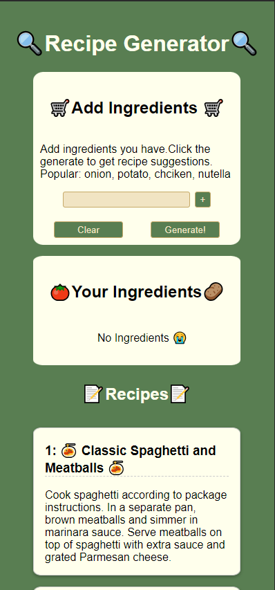
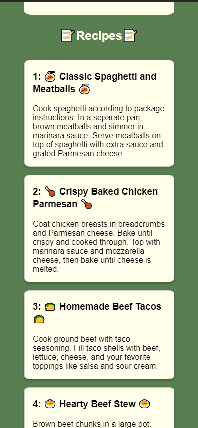
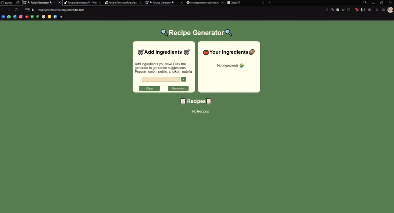

# 🔍Recipe Generator with AI🔍
This is a recipe recommendation & generation app that utilizes user-provided ingredients with the help of AI.  For frontend, React and vanilla CSS is used. NodeJs and OpenAI API is used for the backend. Since AI is used, ingredients are not language- or typo-sensitive, allowing users to input ingredients in any language.

## Live Deployment
You can acces the deployment from this link: [RecipeGenerator/onrender](https://recipegeneratorreactapp.onrender.com). Loading takes a bit because of inactivity.

# Preview 
<h4 align="center">

</h4>

   
  

